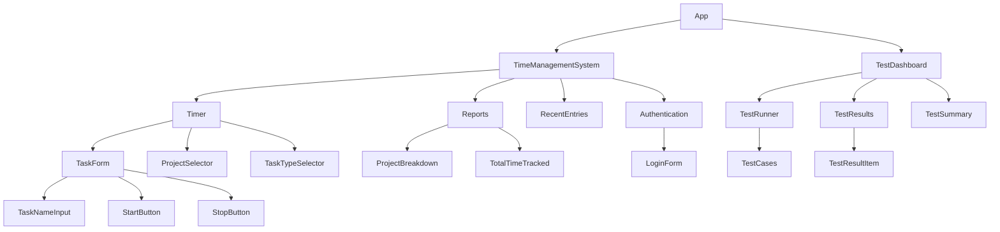

# Time Management System

## Developer's Guide

### Prerequisites
- Node.js (v14 or higher)
- npm (v6 or higher)
- Git

### Setup
1. Clone the repository:
git clone https://github.com/yourusername/time-management-system.git
2. Navigate to the project directory: cd CC_Time_Tracker
3. Install dependencies: npm install
4. Start the development server: npm start
5. Open the application in your browser at `http://localhost:3001`

### Development Workflow
1. Create a new branch for your feature or bug fix: 
git checkout -b feature/your-feature-name
2. Make changes to the codebase
3. Test your changes thoroughly
4. Commit your changes with a descriptive message:
git commit -m "Add new feature"
5. Push your branch to the remote repository:
git push -u origin feature/your-feature-name
6. Open a Pull Request (PR) on GitHub
7. Request a code review from your team members
8. Address any feedback and make necessary changes
9. Once approved, merge the PR into the main branch

### CI/CD Process
This project uses GitHub Actions for Continuous Integration and Deployment. The workflow is defined in the `.github/workflows/main.yml` file.

1. Continuous Integration (CI):
- When a PR is opened or changes are pushed to an existing PR, the CI workflow is triggered
- The workflow checks out the code and sets up Node.js
- It installs dependencies with `npm ci`
- The workflow then runs the test suite using `npm test`
- If the tests pass, the workflow proceeds to the next step

2. Continuous Deployment (CD):
- After a successful CI run, if the changes are merged into the `main` branch, the CD workflow is triggered
- The workflow checks out the code and sets up Node.js
- It installs dependencies with `npm ci`
- The workflow then builds the production-ready application using `npm run build`
- The built files are deployed to the configured hosting platform (e.g., AWS S3, Netlify, Heroku)

3. Monitoring and Feedback:
- After deployment, the application's performance is monitored using tools like Sentry or Datadog
- User feedback is collected through bug reports, feature requests, and analytics
- The development team continuously iterates on the application based on the feedback and monitoring data

To set up the CI/CD pipeline for your project:
1. Configure the `.github/workflows/main.yml` file with your desired workflow steps
2. Set up the required secrets in your GitHub repository settings (e.g., hosting platform API keys)
3. Ensure your tests are comprehensive and cover critical functionality
4. Set up monitoring and error tracking tools and integrate them with your deployment pipeline
5. Regularly review and update the CI/CD process based on your project's evolving needs

## System Architecture

## System Architecture

This diagram shows the main components and their relationships:

The App component contains the TimeManagementSystem and TestDashboard components.
The TimeManagementSystem component includes the Timer, Reports, RecentEntries, and Authentication components.

The Timer component uses the TaskForm, ProjectSelector, and TaskTypeSelector.
The Reports component displays the ProjectBreakdown and TotalTimeTracked.
The Authentication component renders the LoginForm.

The TestDashboard component includes the TestRunner, TestResults, and TestSummary.

The TestRunner uses the TestCases.
The TestResults component renders TestResultItem components.

The TaskForm component contains the TaskNameInput, StartButton, and StopButton.

The communication between components is as follows:

App passes down necessary props and handlers to TimeManagementSystem and TestDashboard.
TimeManagementSystem manages the overall state and passes relevant data and handlers to its child components.

Timer receives handlers for starting and stopping the timer, and submits task data to TimeManagementSystem.
Reports receives the time tracking data from TimeManagementSystem to display the breakdown and total.
RecentEntries receives the list of time entries from TimeManagementSystem.
Authentication communicates the login state and user data to TimeManagementSystem.

TestDashboard manages the test execution and results.

TestRunner runs the TestCases and updates the test results in TestDashboard.
TestResults and TestSummary receive the test data from TestDashboard to display the results.

This diagram provides a high-level overview of the components and their interactions. Let me know if you have any questions or if you'd like me to elaborate on any specific part of the system.
